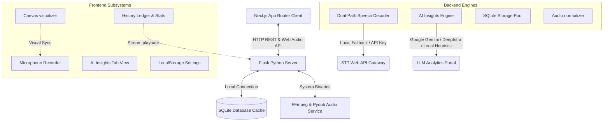

# 🎙️ AURA.transcript — Global Speech-to-Text & AI Insights Suite

**AURA.transcript** is a premium, global-level, full-stack Speech-to-Text (STT) web application. Designed around a futuristic **"Aura Dark"** visual system, it enables users to record voice logs directly in their browser, visualize real-time speech analytics through HTML5 Canvas spectrograms, transcribe recordings instantly with dual-path speech decoders, and extract rich contextual intelligence utilizing automated AI assistants.

---

## 🔮 Core Features & System Intelligence

### 1. Aura Dark High-Fidelity UI/UX
*   **Ambient Backlighting:** Dynamic, blur-filtered space gradients that slowly drift in the background (`globals.css`).
*   **Cyber Spectrograms:** Canvas-based real-time visualizations linked to the browser's `AudioContext` and `AnalyserNode`. Offers **Sine Waves, Frequency Bars, and Pulsing Rings**.
*   **Dual-State Visualization:** Spectrograms dance both during real-time recording *and* when playing back past voice archives!
*   **Glow Indicators & Scanlines:** Pulsing neon rings show recording status, and laser line sweeps highlight AI text processing.

### 2. Dual-Path Speech Recognition Pipeline
*   **Zero-Config Local Fallback:** Utilizes `speech_recognition` (via Google Web Speech API) to operate immediately out-of-the-box without requiring API tokens.
*   **High-Speed Enterprise APIs:** Integrates high-fidelity endpoints for **Deepgram Nova-2** and **DeepInfra Whisper** models.
*   **Header-Based Key Forwarding:** Users can input their custom keys in the frontend Settings UI. Keys are forwarded on requests, preserving absolute server privacy.

### 3. Integrated AI Assistant Hub
*   **Summarization Suite:** Automatically distills lengthy spoken voice recordings into professional markdown summaries complete with Key Takeaways.
*   **Multilingual Translation:** Instant, native-quality translations into 8 languages (Spanish, French, German, Japanese, Hindi, Chinese, Arabic, Portuguese).
*   **Task Checklist Extractor:** Captures TODOs, deadline indicators, assignees, and priority levels directly from voice context.
*   **Tone & Grammar Polisher:** Cleans stuttering, removes filler words, and rewrites transcripts in *Professional, Casual, or Academic* styles.
*   **Self-Healing AI Fallback:** If no Gemini or DeepInfra API key is active, a custom rule-based Heuristic AI parser generates beautiful, mock-structured outputs.

### 4. History Vault & Streaming Playbacks
*   **Full Searchable Archive:** List records, filter by keyword, and view detailed statistics (total recording count, cumulative length, and completed analysis attachments).
*   **Live Stream Playback:** Audits are stored locally on the Flask server as 16kHz Mono WAV files. Users can click Play in their history ledger to stream and listen back to their clips at any time.

---

## 📐 System Architecture & Flow



---

## 🛠️ Technology Stack

*   **Frontend Core:** Next.js (TypeScript, App Router, React 19)
*   **Frontend Styling:** Tailwind CSS v4, Lucide-React Icons
*   **Backend Server:** Flask (Python, Flask-CORS, Python-Dotenv)
*   **Audio Compiling:** Pydub, Native Python Wave Converters
*   **Database Ledger:** SQLite3 (Zero-configuration storage container)

---

## 🚀 Step-by-Step Installation & Launch

### 1. Prerequisite Checklist
*   Ensure **Node.js (v18+)** and **Python (3.9+)** are installed on your host system.
*   *Recommended:* Install **FFmpeg** globally for automatic compression and WebM/OGG file reading. (If FFmpeg is not present, AURA will automatically fall back to pure-Python WAV parsing).

---

### 2. Backend Installation & Startup

1. Navigate to the backend directory:
   ```bash
   cd backend
   ```
2. Create and activate a Python Virtual Environment:
   ```bash
   # On Windows
   python -m venv venv
   .\venv\Scripts\activate

   # On macOS/Linux
   python3 -m venv venv
   source venv/bin/activate
   ```
3. Install package dependencies:
   ```bash
   pip install -r requirements.txt
   ```
4. Copy the environment variables template and configure (Optional):
   ```bash
   cp .env.example .env
   ```
5. Start the backend Flask dev server:
   ```bash
   python app.py
   ```
   *The server initializes at `http://localhost:5000` and creates `backend/instance/database.db` automatically.*

---

### 3. Frontend Installation & Startup

1. Navigate to the frontend directory:
   ```bash
   cd ../frontend
   ```
2. Install npm packages:
   ```bash
   npm install
   ```
3. Copy the environment configuration and adjust if your host ports differ:
   ```bash
   cp .env.example .env.local
   ```
4. Fire up the Next.js local development portal:
   ```bash
   npm run dev
   ```
5. Open your web browser and navigate to **`http://localhost:3000`** to launch **AURA.transcript**.

---

## 🔒 Verification & Compliance Manual

*   **Microphone Permissions:** Upon clicking the recording circle, allow the browser mic request.
*   **Settings Hub:** Press the gear icon in the top navbar. You can set visual spectrogram modes, select recognition languages, choose STT providers, and input credentials.
*   **Offline Mode:** If the connection status badge changes to *Offline*, verify that the Flask backend is currently listening on port 5000.
*   **Print Layout:** Pressing `Ctrl + P` triggers a clean, simplified high-contrast document print layout optimized specifically to save ink.
